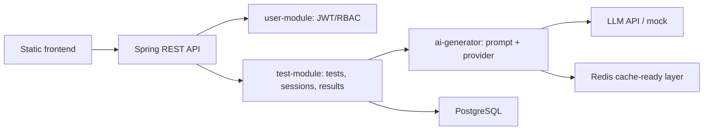
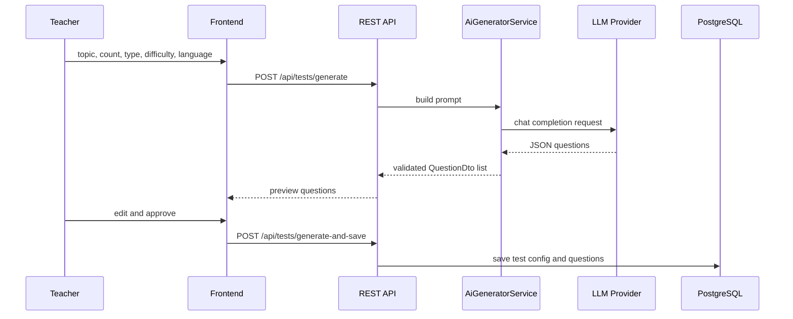

# Test Management System AI

Тест жасау және басқару жүйесі. Платформа оқытушыға тақырып, күрделілік, сұрақ саны, типі және тілін таңдауға мүмкіндік береді, ал AI сұрақтарды preview ретінде генерациялайды. Оқытушы сұрақтарды өңдеп, тестті жариялайды; студент тест тапсырып, жабық сұрақтар бойынша нәтижені бірден алады.

## Технологиялар

- Java 17, Spring Boot 3.2
- Maven multi-module: `core`, `user-module`, `test-module`, `ai-generator`, `app`
- PostgreSQL, Redis
- JWT Bearer auth, BCrypt password hashing
- Spring Data JPA, Spring Security, Spring WebFlux
- Swagger/OpenAPI: `/swagger-ui/index.html`
- LLM provider strategy: local mock by default, DeepSeek/OpenAI-compatible chat-completions endpoint by config

## Архитектура



AI генерация ағымы:



## Жергілікті іске қосу

1. `.env.example` файлын `.env` ретінде көшіріп, мәндерді толтырыңыз.
2. PostgreSQL және Redis іске қосыңыз:

```bash
docker compose up -d postgres redis
```

3. Қосымшаны іске қосыңыз:

```bash
mvn -pl app spring-boot:run
```

4. Браузерде ашыңыз:

- Frontend: `http://localhost:8080/landing.html`
- Swagger UI: `http://localhost:8080/swagger-ui/index.html`

## AI провайдерін баптау

Әдепкі режим:

```env
LLM_PROVIDER=mock
```

Бұл режим интернетсіз және API кілтсіз жұмыс істейді.

DeepSeek немесе OpenAI-compatible endpoint:

```env
LLM_PROVIDER=deepseek
DEEPSEEK_API_KEY=your_key
DEEPSEEK_MODEL=deepseek-chat
DEEPSEEK_URL=https://api.deepseek.com/v1/chat/completions
```

Ollama үшін chat-completions compatible proxy немесе бөлек клиент қосу керек. Docker Compose ішінде Ollama сервисі бар, оны былай іске қосуға болады:

```bash
docker compose up -d ollama
```

## Негізгі API мысалдары

Тіркелу:

```http
POST /api/auth/register
Content-Type: application/json

{
  "name": "Teacher",
  "email": "teacher@example.com",
  "password": "password",
  "role": "TEACHER"
}
```

AI preview генерациясы:

```http
POST /api/tests/generate?topic=Java&difficulty=Medium&questionType=Mixed&language=kk&count=10
Authorization: Bearer <token>
```

Preview сұрақтарын сақтау:

```http
POST /api/tests/generate-and-save
Authorization: Bearer <token>
Content-Type: application/json

{
  "title": "Java негіздері",
  "topic": "Java",
  "difficulty": "Medium",
  "questionType": "Mixed",
  "count": 2,
  "timerMin": 15,
  "language": "kk",
  "creatorId": 1,
  "status": "PUBLISHED",
  "previewQuestions": [
    {
      "question": "Java деген не?",
      "options": ["Тіл", "ДҚ", "ОЖ", "Браузер"],
      "correctIndices": [0],
      "correct": 0,
      "open": false
    }
  ]
}
```

## ТЗ бойынша орындалған негізгі мүмкіндіктер

- Email/password тіркелу және JWT login
- RBAC: STUDENT / TEACHER / ADMIN рөлдері
- AI арқылы Single / Multiple / Mixed / Open сұрақтарын генерациялау
- Preview режимінде сұрақтарды өңдеу және сақтау
- Тестті DRAFT / PUBLISHED / CLOSED / ARCHIVED күйіне ауыстыру
- Студент тестті бастап, жауап жіберіп, нәтижені алады
- Мұғалім тест статистикасын қарай алады
- Swagger/OpenAPI қосылған
- Docker Compose: PostgreSQL, Redis, Ollama

## ТЗ бойынша қосылған кеңейтімдер

- OAuth2 Google login flow және callback беті
- JWT refresh token, logout/revoke және frontend auto-refresh
- ABAC: оқытушы өз тестін ғана өзгертіп/жоя алады
- Rate limiting, brute-force lockout және audit log
- AI retry, timeout және circuit-breaker fallback
- CSV/PDF export, рейтинг және ашық жауаптарды бағалау endpoint-тері
- Token usage summary және admin audit dashboard
- Dockerfile, Docker Compose толық стек, Kubernetes manifests
- GitHub Actions CI, OWASP/Sonar placeholder, deploy placeholder
- Postman collection, prompt шаблондары және жүйелік/пайдаланушы құжаттары
